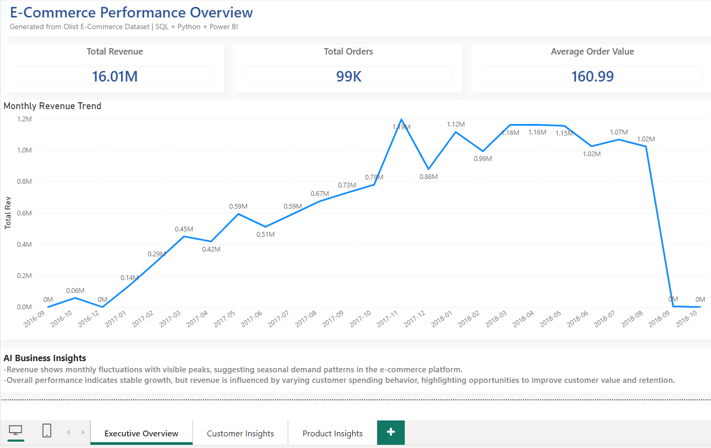
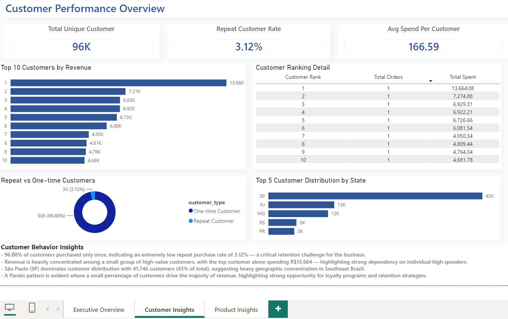
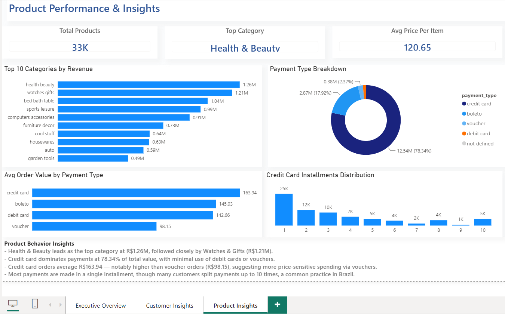

# End-to-End E-Commerce Analytics Platform


An end-to-end Business Intelligence project built using the Olist Brazilian E-Commerce dataset. This project demonstrates a full analytics lifecycle from raw data processing to business insight delivery using SQL, Python, Power BI, and automation.

The objective is to convert raw transactional data into actionable insights that support business decision-making.

**Kaggle Dataset:** [Brazilian E-Commerce Public Dataset by Olist](https://www.kaggle.com/datasets/olistbr/brazilian-ecommerce)

---

## Project Overview

This project simulates a real-world BI system for an e-commerce business.

### End-to-End Workflow:
- Data cleaning and preprocessing (Python)
- Structured data storage (SQLite)
- Business analysis (SQL)
- KPI dashboards (Power BI)
- Automated insights generation
- CI/CD pipeline (GitHub Actions)

---

## Business Questions & Insights

### 1. Revenue Trends
- Total revenue: **R$16.01M** across 99,441 orders.
- Revenue shows fluctuations over time, indicating seasonal demand patterns.

---

### 2. Product Performance
- **Health & Beauty** is the top revenue contributor.
- Revenue is concentrated in a small number of categories, indicating dependency on core products.

---

### 3. High-Value Customers
- A small percentage of customers contributes a large portion of revenue.
- This indicates strong opportunity for customer segmentation and targeted marketing strategies.

---

### 4. Customer Retention
- Repeat customer rate is **3.12%**, which is very low for an e-commerce business.
- This highlights a critical gap in customer loyalty and retention strategy.

---

### 5. Payment Behavior
- Credit cards account for **78.3% of transactions**.
- Installment usage indicates customers prefer flexible payment options for higher-value purchases.

---

### 6. Regional Distribution
- São Paulo contributes **43% of total customers**.
- Customer base is highly concentrated, suggesting expansion opportunities in other regions.

---

## Key Business Takeaways

- Revenue is heavily dependent on a small number of product categories.
- Customer retention is a major weakness (3.12% repeat rate vs expected higher benchmark in e-commerce).
- Credit card is the dominant payment method (78.3%).
- Strong geographic concentration in São Paulo creates expansion opportunity risk.
- Overall business growth is strongly tied to improving retention and diversification.

---

## Power BI Dashboard Preview

### Executive Overview
KPIs including revenue, total orders, and average order value (AOV).



---

### Customer Insights
Customer segmentation, retention behavior, and geographic distribution.



---

### Product Insights
Product category performance and payment behavior analysis.



---

## Data Model

A star-schema model was designed in Power BI to support scalable KPI reporting.

### Fact Tables
- Orders
- Payments

### Dimension Tables
- Customers
- Products
- Sellers
- Dates

This structure enables efficient filtering, aggregation, and drill-down analysis.

*(Data model diagram can be added here for stronger portfolio impact)*

---

## Tech Stack & Usage

- **Python** → Data cleaning, transformation, automation
- **SQL** → Business analysis, KPI extraction, aggregation logic
- **Power BI** → Dashboarding, DAX measures, data modeling
- **GitHub Actions** → Automated ETL pipeline execution

---

## Skills Demonstrated

### SQL
- Joins
- CTEs
- Window Functions
- Aggregations
- KPI Calculations

### Power BI
- Data Modeling
- DAX Measures
- Power Query
- Interactive Dashboards
- KPI Reporting

### Python
- ETL Pipelines
- Data Cleaning
- SQLite Automation

### Analytics
- Revenue Analysis
- Customer Segmentation
- Retention Analysis
- Product Performance
- Payment Behavior Analysis

---

## AI & Automation Layer

The project includes an automated insights engine:

```text
ai/insights_generator.py
```

It extracts KPI metrics directly from SQLite and generates automated business insights.

Due to API limitations (Google Gemini / Anthropic Claude free tiers), a rule-based system was implemented instead of external AI APIs.

This ensures:
- Fully reproducible outputs
- No external dependencies
- Consistent insights generation

---

## Automation (CI/CD Pipeline)

GitHub Actions runs the full data pipeline:

```text
.github/workflows/data_pipeline.yml
```

Pipeline steps:
- Run ETL scripts
- Validate data
- Update SQLite database
- Ensure reproducibility

---

## Business Impact

This project demonstrates how data analytics can directly support business decisions:

- Improve revenue monitoring
- Identify high-value customers
- Strengthen retention strategy
- Optimize product performance
- Analyze payment behavior
- Support expansion decisions

---

## Future Improvements

- Customer Lifetime Value (CLV)
- RFM segmentation
- Sales forecasting models
- Real-time dashboards
- Cloud data warehouse integration

---

## About This Project

This project demonstrates end-to-end BI capability, combining SQL, Python, and Power BI to solve real-world business problems using data.

---

## Skills Summary

Power BI • SQL • Python • Data Analytics • Dashboard Development • Business Intelligence • KPI Reporting

---

## About Me

Data Analyst with a background in People Analytics and BI. Currently open to Data Analyst, BI Analyst, and Analytics roles across industries.

📎 [LinkedIn](https://www.linkedin.com/in/joyceleehowyee/) · [GitHub Portfolio](https://github.com/joyceleehy)


