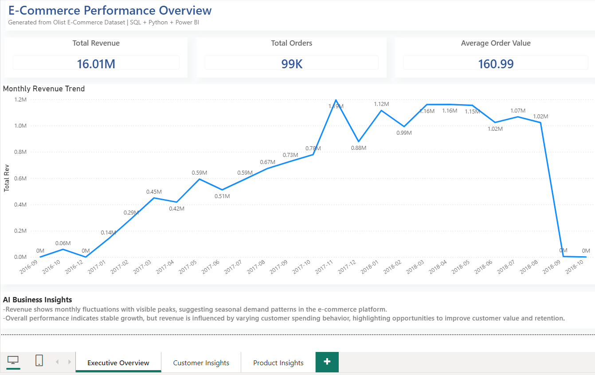
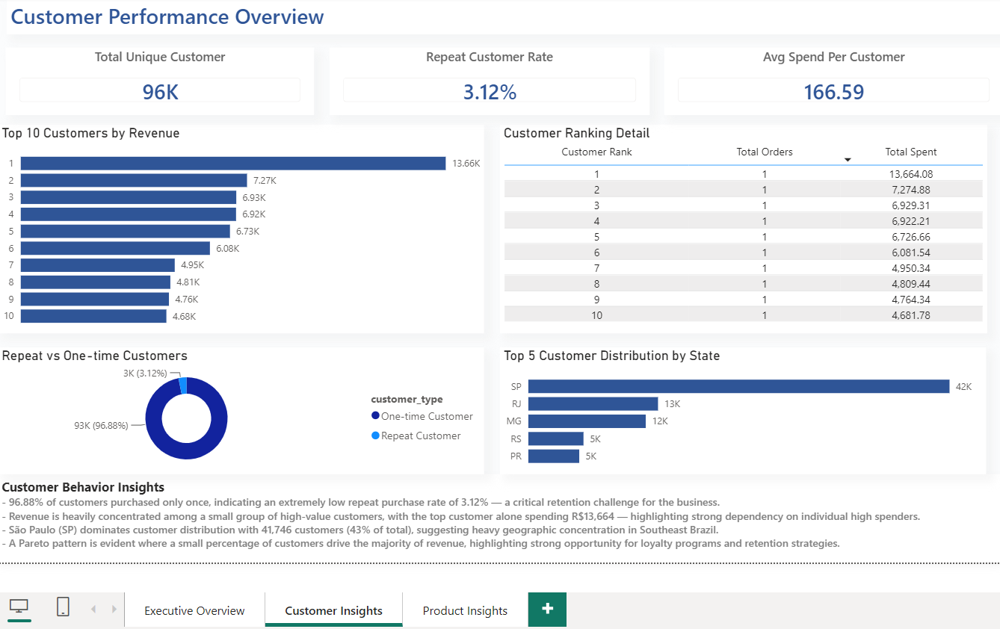
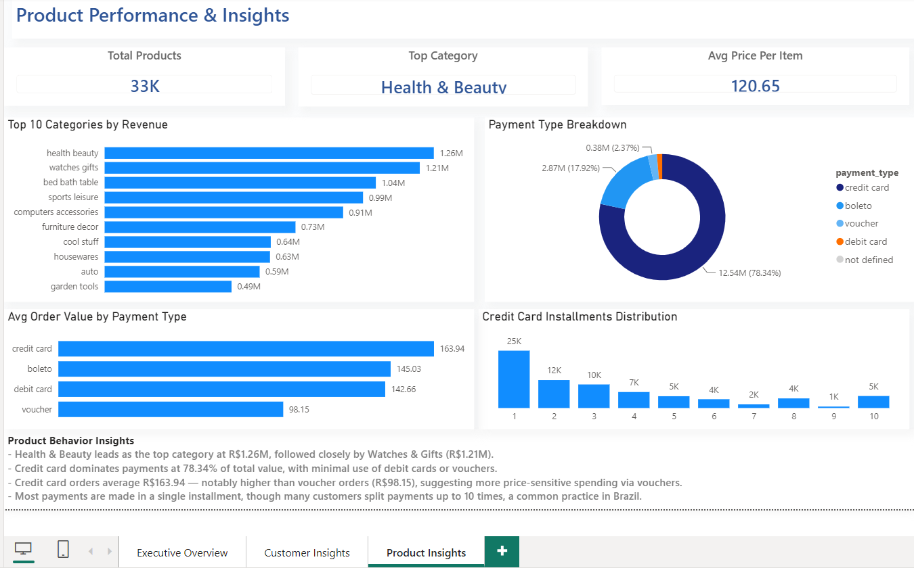

# E-Commerce Business Intelligence Analytics Platform


An end-to-end Business Intelligence analytics project using **Python, SQL, and Power BI** to transform raw e-commerce data into interactive dashboards and actionable business insights. The project demonstrates a complete BI workflow, including data cleaning, database creation, KPI reporting, automation, and dashboard development using the Olist Brazilian E-Commerce dataset.

---

## Business Problem

E-commerce businesses generate large volumes of transactional data, but raw data alone does not support effective decision-making. This project demonstrates how Business Intelligence techniques can be used to transform raw sales data into meaningful insights that help stakeholders monitor revenue performance, customer behavior, product performance, payment trends, and business growth opportunities.

---

## Dataset

**Source:** Brazilian E-Commerce Public Dataset by Olist (Kaggle)

https://www.kaggle.com/datasets/olistbr/brazilian-ecommerce

**Dataset Size**

- 99,441 Orders
- 2016–2018
- Multiple related tables including:
  - Customers
  - Orders
  - Order Items
  - Payments
  - Products
  - Sellers
  - Categories

---

## Tools & Technologies

- **Python** – Data cleaning, ETL automation, validation
- **SQL (SQLite)** – Data storage and business analysis
- **Power BI** – Data modeling, DAX, Power Query, dashboard development
- **GitHub Actions** – Automated CI/CD data pipeline
- **Git & GitHub** – Version control

---

## Data Pipeline

```text
Raw CSV Files
      ↓
Python Data Cleaning & Validation
      ↓
SQLite Database
      ↓
SQL Business Analysis
      ↓
Power BI Data Model
      ↓
Interactive Dashboard
      ↓
Automated Business Insights
```
---
## Architecture Overview

```text
                  Raw Data
                     │
                     ▼
        Python ETL & Data Validation
                     │
                     ▼
              SQLite Database
                     │
          ┌──────────┴──────────┐
          ▼                     ▼
    SQL Analysis          Power BI Model
          │                     │
          └──────────┬──────────┘
                     ▼
            KPI Dashboards
                     │
                     ▼
          Business Insights & Decisions
```
---

## Key Business Insights

### Revenue Performance

- Generated **R$16.01M** in total revenue across **99,441 orders**
- Monthly sales trends reveal seasonal demand fluctuations that support forecasting and inventory planning.

### Product Performance

- Health & Beauty is the highest revenue-generating product category.
- Revenue is concentrated within a relatively small number of product categories, indicating dependency on core products.

### Customer Analysis

- A small proportion of customers contributes a significant share of total revenue.
- Customer segmentation presents opportunities for targeted marketing and retention campaigns.

### Customer Retention

- Repeat customer rate is only **3.12%**, significantly below typical e-commerce benchmarks.
- Improving customer loyalty represents one of the largest business growth opportunities.

### Payment Behaviour

- Credit cards account for **78.3%** of transaction value.
- Installment payments are widely used, reflecting common purchasing behaviour within the Brazilian market.

### Geographic Distribution

- Approximately **43%** of customers are located in São Paulo.
- Heavy geographic concentration creates both market opportunities and business risk.

---

## Business Recommendations

- Improve customer retention through loyalty programmes and personalised marketing.
- Diversify revenue by expanding lower-performing product categories.
- Expand customer acquisition outside São Paulo to reduce geographic concentration risk.
- Monitor seasonal demand patterns to optimise inventory planning.
- Develop customer segmentation strategies for high-value customer groups.

---

## Power BI Dashboard

### Executive Overview

Displays executive KPIs including:

- Total Revenue
- Total Orders
- Average Order Value
- Monthly Revenue Trend



---

### Customer Insights

Provides customer-focused analysis including:

- Customer ranking
- Repeat customer analysis
- Geographic distribution
- Customer contribution



---

### Product Insights

Analyzes:

- Product category performance
- Revenue contribution
- Payment methods
- Payment installment behaviour



---

## Data Model

The Power BI semantic model is built from SQLite tables including:

- Orders
- Customers
- Payments
- Products
- Category Translation

Relationships are established using Order ID and Product ID to support customer, revenue, payment, and product analysis across multiple dashboard pages.

---

## Automation & Insight Generation

The project includes an automated insight generation module located in:

```
ai/insights_generator.py
```

The script extracts live KPI metrics directly from the SQLite database and generates rule-based business insights using predefined business logic. This approach provides consistent and reproducible insight generation without relying on external AI APIs.

GitHub Actions automatically executes the data pipeline, enabling an end-to-end reproducible analytics workflow.

---

## Skills Demonstrated

### Business Intelligence

- KPI Reporting
- Dashboard Design
- Executive Reporting
- Business Analysis
- Data Visualization

### Data Analytics

- Data Cleaning
- Data Validation
- Exploratory Data Analysis
- Revenue Analysis
- Customer Analysis
- Product Performance Analysis

### Technical Skills

- Python
- SQL
- Power BI
- Power Query
- DAX
- SQLite
- GitHub Actions
- Git

---

## Getting Started

Clone the repository:

```bash
git clone https://github.com/joyceleehy/ecommerce-analytics-ai-automation.git
```

Install dependencies:

```bash
pip install pandas
```

Run the pipeline:

```bash
cd python

python 02_data_cleaning.py

python 03_create_database.py
```

Generate automated insights:

```bash
cd ../ai

python insights_generator.py
```

---

## Future Improvements

- Customer Lifetime Value (CLV) analysis
- RFM Customer Segmentation
- Sales Forecasting
- Cloud Data Warehouse integration
- Interactive Executive Scorecards
- Automated BI report distribution

---

## About Me

**Joyce Lee How Yee**

PL-300 Certified Business Intelligence & Data Analyst with experience in People Analytics, SQL, Python, Power BI, Tableau, and HR reporting. Passionate about building end-to-end analytics solutions that transform data into actionable business insights.

- **LinkedIn:** https://www.linkedin.com/in/joyceleehowyee/
- **GitHub:** https://github.com/joyceleehy
